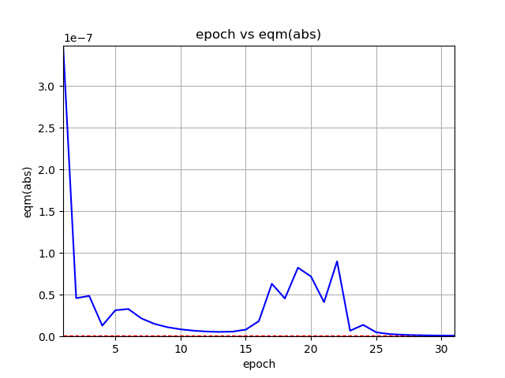

# nn-python
Simple Python implementation of some Neural Networks

Currently the following flavors are available:
- Simple Layer Perceptron (with Hebbian learning)
- Simple Layer Perceptron (with Delta rule)
- Multilayer Perceptron
